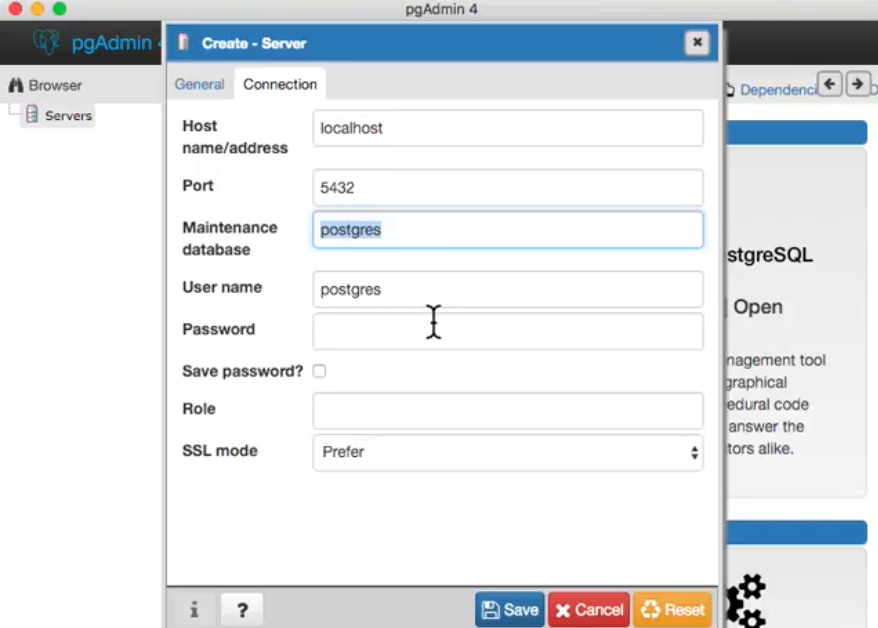
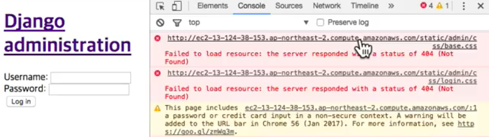
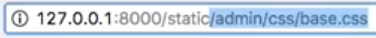
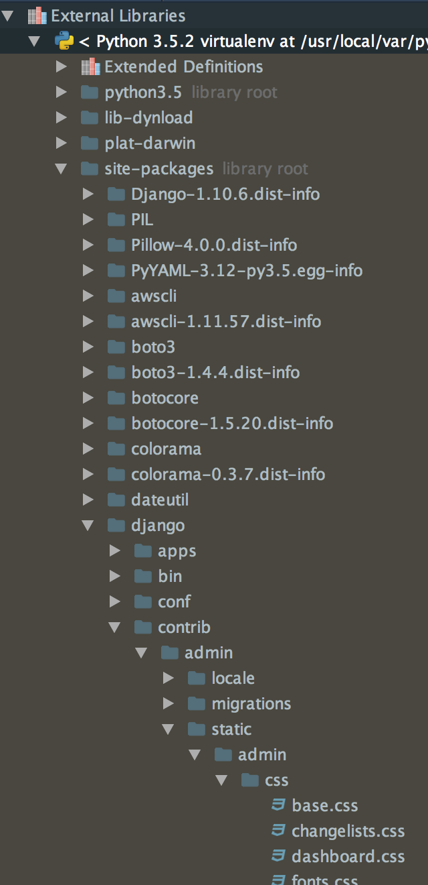
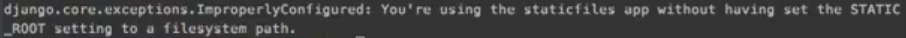
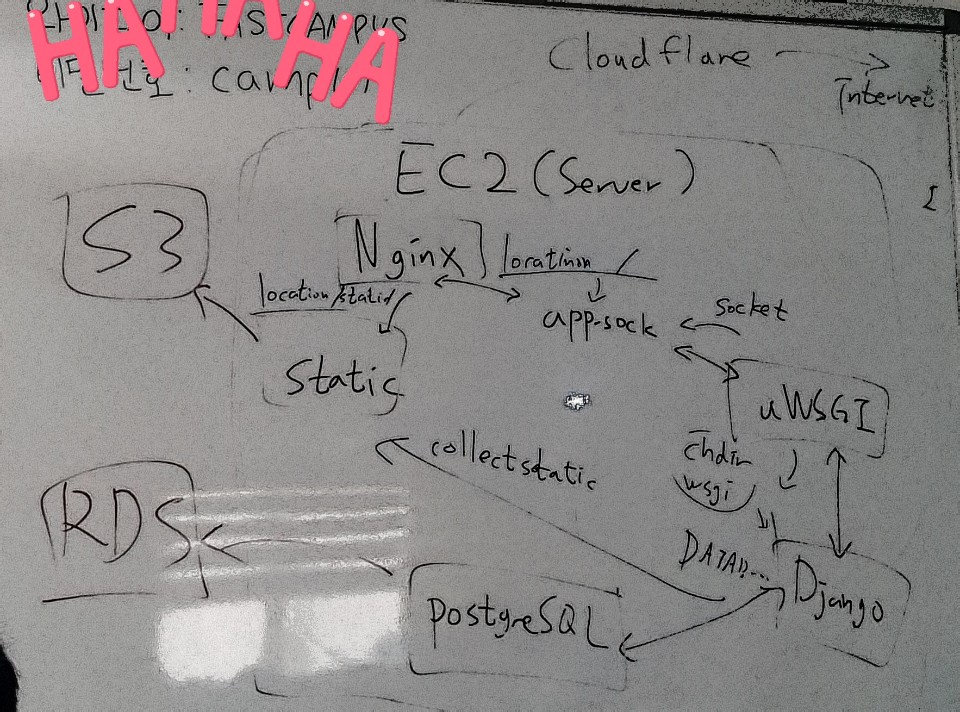

## postgresql

#### pgadmin4 설치  
<https://www.pgadmin.org/>


### postgresql 설치 및 pgAdmin 연결

#### 호스트 접속정셋팅 설정

호스트 접속 설정은 실제 로컬에서 테스트 할 값과 서버상의 값은 달라야 한다.

(파이참에서)  
.conf-secret/settings_deploy.json 추가

```
# 서버에서는 설정해둔 호스트 외에는 접근을 금지시켜야 한다.
{
  "django": {
    "allowed_hosts": [
      "aws 인스턴스 주소",
      "aws 인스턴스 .뒷주소",
      "도메인 URL"]
  },
  "db": {
    "engine": "django.db.backends.postgresql_psycopg2",
    "name": "db name",
    "user": "db user",
    "password": "db user password",
    "host": "localhost",
    "port": "5432"
  }
}
```
.conf-secret/settings_local.json 추가 셋팅

```
# 로컬에서는 접근하는 호스트가 어디여도 상관없기 때문에 "*"으로 한다.
{
  "django": {
    "allowed_hosts": [
      "*"
    ]
  },
  "db": {
    "engine": "django.db.backends.postgresql_psycopg2",
    "name": "db name",
    "user": "db user",
    "password": "dbuser password",
    "host": "localhost",
    "port": "5432"
  }
}
```
#### pgAdmin 연결


#### user, DB 생성
(로컬에서)

```
brew install postgresql
brew services start postgresql
# brew으로 postgresql 설치 및 서비스 시작
createuser -s -P username
# -s : super 유저 생성
# -P : password 필요
createdb czarcie --owner=czarcie
# createdb dbname : db 생성
# --owner=username : 소유자 설정
```

#### 파이참 셋팅에서 DB 연결
(파이참에서)
setting.py 를 수정하여 DB를 연결한다.

```
DATABASES = {
    'default': {
        'ENGINE': 'django.db.backends.postgresql_psycopg2',
        'NAME': 'myproject',
        'USER': 'myprojectuser',
        'PASSWORD': 'password',
        'HOST': 'localhost',
        'PORT': '',
    }
}
```

```
# 실제 작성시

DATABASES = {
    'default': {
        'ENGINE': config['db']['engine'],
        'NAME': config['db']['name'],
        'USER': config['db']['user'],
        'PASSWORD': config['db']['password'],
        'HOST': config['db']['host'],
        'PORT': config['db']['port'],
    }
}
```

(파이참에서)

```
pip install psycopg2
makemigrations
migrate
```

#### 배포환경기 구분하기
(파이참 settings.py)

```
# 'MODE'라는 key에 'DEBUG'라는 값이 들어오면 DEBUG로 판단

DEBUG = os.environ.get('MODE') == 'DEBUG'
print('DEBUG : {}'.format(DEBUG))
```
##### 환경변수 확인방법
**shell**에서는 

```
env
```  

**python** 안에서는

```
>>> import os
>>> os.environ
```
Django를 사용할때 인터프리터를 사용하여 바로 입력이 가능합니다.
(django_app안에서)

```
MODE='DEBUG' ./manage.py runserver

# 로컬에서 실행할때는 항상 이렇게 해야한다.
```
-
##### script 설정
매번 `MODE='DEBUG' ./manage.py runserver`를 입력하여 실행하기엔 불편합니다. 그래서 script 설정을 하여 조금이라도 귀찮음을 해결합니다.

```
# home / mkdir .scripts
cd .scripts/
vi manage

!/bin/bash
MODE='DEBUG' .manage.py $*

# manage 뒤에 오는 명령변수를 $* 으로 대입한다. 
```

```
# manage 파일의 퍼미션을 755 으로 변경한다.
chmod 755 manage
```

```
# z-shell에 적용
vi ~/.zshrc

 # My Scripts
 export SCRIPT_PATH="/Users/makingfunk/.scripts"
 export PATH="$PATH:$SCRIPTS_PATH"

chmod 755 manage
```
-

#### postgresql 설치
(서버에)

```
sudo apt-get update
sudo apt-get install postgresql postgresql-contrib
# postgresql 설치
sudo -u postgres createuser -s -P czarcie
# super 유져 생성(-s : super user, -P : password 설정)
sudo -u postgres createdb czarcie --owner=czarcie
# db를 생성하고 관리자 설정
```

## StaticFiles 설정

(파이참의 settings.py)

```
# static setting
STATIC_DIR = os.path.join(BASE_DIR, 'static')
STATIC_ROOT = os.path.join(ROOT_DIR, 'static_root')
STATIC_URL = '/static/'
STATICFILES_DIRS = (
    STATIC_DIR,
)
```
> script 설정으로 `manage runserver'으로 서버 실행하면 됩니다.

ec2 에 Django를 업로드를 하고 ec2 내에 `static`폴더가 잘 들어갔는지 확인해봅니다.  
확인 후 `uwsgi`를 재시작합니다. `(sudo systemctl uwsgi)`






아직까진 브라우저에서 ec2 인스턴스 주소로 접속해보면 static으로 연결한 이미지(파일들)이 열리지 않습니다. 그리고 인스턴스 주소뒤에 admin을 입력하여 접속하면 admin이 css가 적용되지 않았습니다.
우리는 실제로 셋팅할때 css를 건들지 않았습니다.  



(Django에서)

`External Libraries > siste-packages > django > contrib > admin > static > admin > css > base.css`
에서 확인 할 수 있습니다.


#### collectstatic
static 파일들을 모아줍니다.

```
./manage.py collectstatic
```


STATIC_ROOT를 설정하지 않았기 떄문에 오류가 납니다.

```
# static setting
STATIC_DIR = os.path.join(BASE_DIR, 'static')
STATIC_ROOT = os.path.join(ROOT_DIR, 'static_root')
STATIC_URL = '/static/'
STATICFILES_DIRS = (
    STATIC_DIR,
)
```

static_root는 git에 노추되면 안되기 때문에 .gitignore.txt 파일에 추가해줍니다.

그리고 ec2 에 업로드 합니다. (scp -t -i ....)

##### 서버에서 `collectstatic`를 실행합니다.

(서버에서)

```
./manage.py collectstatic
``` 
그리고 다시 uwsgi 리스타트합니다.

##### Nginx에게 static이 오면 어디로 가야하는지 설정해줍니다.

(서버에서)

```
sudo vi /etc/nginx/sites-available/app

 
    location /static/ {
        alias /srv/app/static_root/;
    }
```

그리고 다시 uwsgi 리스타트.

이제 도메인으로 접속하면 static 파일들이 정상 출력되는 것을 확인 할 수 있습니다.


---------------정리 예정---------------
시간이 너무 부족해....


psql postgres czarcie(게정)

db날리기
dropdb czarcie

(로컬에서)
createdb czarcie owner=czarcie
manage makemigrations
manage migrate

(서버세어)
sudo -u postgres dropdb czarcie
sudo -u postgres createdb czarcie owner=czarcie
./manage.py makemigrations
./manage.py migrate
sudo systemctl restart nginx uwsgi
./manage.py 

app/media
chmod 777 폴더명
/media
sudo rm -rf user

admin들어가서 프로필 사진 올라가는지 확인
들어는 가나 누르면 오류가 뜸(정상)



# MEDIA 설정

'sudo vi /etc/nginx/sites-available/app'

## Media

```
    location /media/ {
        alias /srv/app/media/;
    }
```

## Static

```
    location /static/ {
        alias /srv/app/static_root/;
    }
```

```
>>> client.create_bucket(Bucket='czarcie-bucket', CreateBucketConfiguration={'LocationConstraint': 'ap-northeast-2'})
{'Location': 'http://czarcie-bucket.s3.amazonaws.com/', 'ResponseMetadata': {'RetryAttempts': 0, 'RequestId': '7F0A1659F4D8FC54', 'HTTPHeaders': {'x-amz-id-2': 'K7cImLhau0a7J+EnpBz7+JQp317tmYHiYyeVggRUEhXGiv3gLbtdKDeCUFt8QqjyhfY+TAj7tmw=', 'x-amz-request-id': '7F0A1659F4D8FC54', 'server': 'AmazonS3', 'content-length': '0', 'location': 'http://czarcie-bucket.s3.amazonaws.com/', 'date': 'Wed, 08 Mar 2017 08:51:04 GMT'}, 'HostId': 'K7cImLhau0a7J+EnpBz7+JQp317tmYHiYyeVggRUEhXGiv3gLbtdKDeCUFt8QqjyhfY+TAj7tmw=', 'HTTPStatusCode': 200}}
```


## 서버 설정

### Media

> 본인의 media폴더 위치를 확인

`sudo vi /etc/nginx/sites-available/app`

```
location /media/ {
	alias /srv/app/media/;
}
```

**이미지 업로드시 Permission Denied발생 할 경우**  
`sudo chmod 777 media`로 `media`폴더의 권한을 변경, `media`폴더 하위 폴더 모두 삭제 후 다시 실행


### Static

> 본인의 static_root폴더 위치를 확인

`sudo vi /etc/nginx/sites-available/app`

```
location /static/ {
	alias /srv/app/static_root/;
}
```

### 데이터베이스

> macOS에서는 `sudo -u postgres` 입력 불필요

**유저생성**  
`sudo -u postgres createuser -s -P <username>`

**유저삭제**  
`sudo -u postgres dropuser <username>`

**삭제**  
`sudo -u postgres dropdb <db name>`

**생성**  
`sudo -u postgres createdb <db name> owner=<owner name>`


-

#### AWS Secutiriy Groups 80 Port추가

Security Groups -> Inbound -> Edit -> HTTP


