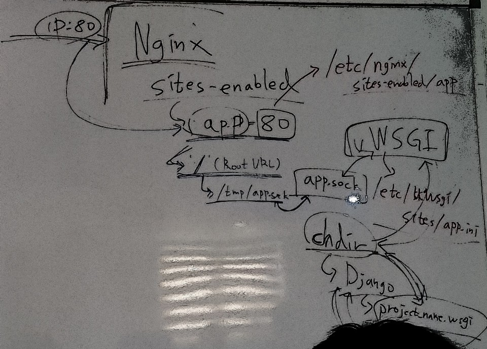

# Ubuntu Linux Deploy
-
> AWS EC2 + Ubuntu16.04 + Nginx + uWSGI + Django



### 개념
**Ubuntu Linux**  
서버의 OS

**Nginx** 
웹 서버. 클라이언트로부터의 HTTP요청을 받아 정적인 페이지/파일을 돌려준다.

**Django**  
웹 애플리케이션. 웹 요청에 대해 동적데이터를 돌려준다.

**uWSGI**  
웹 서버(Nginx)와 웹 애플리케이션(Django)간의 연결을 중계해준다.  
(Nginx에서 받은 요청을 Django에서 처리하기 위한 중계인 역할을 해준다)

**WSGI**  
Web Server Gateway Interface  
파이썬에서 웹 서버와 웹 애플리케이션간의 동작을 중계해주는 인터페이스


## path 요약(서버)
**Nginx 동작**  
`/etc/nginx/nginx.conf`  

**Nginx 가상서버 설정 파일**  
`/etc/nginx/sites-available/app`  

**uWSGI 사이트 파일**  
`/etc/uwsgi/sites/app.ini`  

**uWSGI 서비스 설정파일**  
`/etc/systemd/system/uwsgi.service`  

**Nginx log파일**  
`/var/log/nginx`

**Soket, pid**  
`/tmp/`

## Instance생성

**Key pair  다운받은 후 ~/.ssh 으로 복사후 권한 설정**

```
chmod 400 KeyPair.pem
```

**권한 설정 후 aws 에 pem파일을 통해 AWS 접속**(경로 상관없음)  

```
ssh -i ~/.ssh/KeyPair.pem ubuntu@ec2-13-124-46-220.ap-northeast-2.compute.amazonaws.com
```

**언어팩 설치** (서버에)

```
sudo apt-get install language-pack-ko
sudo locale-gen ko_KR.UTF-8
```

## Ubuntu 기본 설정

**서버에 기본 설치 하기전에**   (서버에)  
> 패키지 인덱스 정보를 업데이트

```
sudo apt-get update
```
**python-pip설치**  

```
sudo apt-get install python-pip
```
**zsh 설치**  

```
sudo apt-get install zsh
```
**oh-my-zsh 설치**  

```
sudo curl -L http://install.ohmyz.sh | sh
```
**Default shell 변경**  

```
sudo chsh ubuntu -s /usr/bin/zsh
```
**서버 종료 후 재 접속**

**pyenv requirements설치 [공식문서](https://github.com/pyenv/pyenv/wiki/Common-build-problems)**

```
sudo apt-get install -y make build-essential libssl-dev zlib1g-dev libbz2-dev \
libreadline-dev libsqlite3-dev wget curl llvm libncurses5-dev libncursesw5-dev xz-utils
```
**pyenv 설치**  

```
curl -L https://raw.githubusercontent.com/yyuu/pyenv-installer/master/bin/pyenv-installer | bash
```
**pyenv 설정 .zshrc에 기록**  

```
vi ~/.zshrc

export PATH="/home/ubuntu/.pyenv/bin:$PATH"
eval "$(pyenv init -)"
eval "$(pyenv virtualenv-init -)"
```
```
source ~/.zshrc
```

**Pillow 라이브러리 설치**  

```
pip install Pillow
```

```
sudo apt-get install libtiff5-dev libjpeg8-dev zlib1g-dev \
    libfreetype6-dev liblcms2-dev libwebp-dev tcl8.6-dev tk8.6-dev python-tk
```

## Django 관련 설정

**권한 설정**(서버 루트에서)  

```
sudo chown -R username:username /srv/
```
> 기본값으로 www-data 가 설정되어있다.
> [관련설명]  
> <http://www.thegeekstuff.com/2010/09/linux-file-system-structure/?utm_source=tuicool>

**srv 안에 app폴더 생성**

**AWS 업로드** (로컬에서 실행)  

```
scp -r -i ~/.ssh/KeyPair.pem . ubuntu@ec2-13-124-46-220.ap-northeast-2.compute.amazonaws.com:/srv/app/
```  

또는 **프로젝트 Clone**

```
git clone <자신의 프로젝트>
```

### 서버에 환경설정
-
**pyenv 3.5.2 설치**

```
pyenv install 3.5.2
```

**가상환경 설정**(서버에서)  
app 으로 이동 후

```
pyenv virtualenv 3.5.2 czarcie
```

**requirements 설치**

```
pip install -r requirements.txt
```
-
**가상환경내에서 설치가 된것인지 반드시 확인해야한다.
서버에 재접속해서 확인해 보면 가상환경에 설치가 되지 않는 버그가 존재한다.**

-

**서버 구동 확인** (서버내에 프로젝트 경로에서)  

```
./manage.py runserver 0.0.0.0:8000
```

**AWS Secutiriy Groups 8080 Port추가**(AWS에서)  
Security Groups -> Inbound -> Edit -> Custom TCP Rule -> 8080

**ALLOWED_HOSTS 설정**

```
vi mysite/settings.py
ALLOWED_HOSTS = [
    '<ec2 domain name'>,
    또는
    '.amazonaws.com',
]
```

**설치된 패키지 업그레이드**

```
sudo apt-get dist-upgrade
sudo shutdown -r now
```
> (의존성을 검사하며 설치)  
> 재접속하는데 시간이 좀 걸림.

## uWSGI 관련 설정

**웹 서버 관리용 유저 생성**  

```
sudo adduser www-data
```
> (기본으로 'www-data'으로 만들어져 있음)

**uWSGI설치**  

`srv/app/` 에서

```
pip install uwsgi
```

**uWSGI 정상 동작 확인**  

```
uwsgi --http :8080 --home (virtualenv경로) --chdir (django프로젝트 경로) -w (프로젝트명).wsg
```
ex)

```
uwsgi --http :8000 --home ~/.pyenv/versions/czarcie --chdir /srv/app/django_app -w czarcie.wsgi
```
> 실행 후 :8000으로 접속하여 요청을 잘 받는지 확인

**uWSGI 사이트 파일 작성**  

```
sudo mkdir /etc/uwsgi
sudo mkdir /etc/uwsgi/sites
sudo vi /etc/uwsgi/sites/app.ini

[uwsgi]
chdir = /srv/app/django_app # Django application folder
module = czarcie.wsgi:application # Django project name.wsgi
home = /home/ubuntu/.pyenv/versions/czarcie # VirtualEnv location

uid = www-data
gid = www-data

socket = /tmp/app.sock
chmod-socket = 666
chown-socket = www-data:www-data

enable-threads = true
master = true
pidfile = /tmp/app.pid
```
**uWSGI site파일로 정상 동작 확인**  

```
sudo /home/ubuntu/.pyenv/versions/czarcie/bin/uwsgi --http :8000 -i /etc/uwsgi/sites/app.ini
```

**uWSGI 서비스 설정파일 작성**

```
sudo vi /etc/systemd/system/uwsgi.service

[Unit]
Description=uWSGI Emperor service
After=syslog.target

[Service]
ExecPre=/bin/sh -c 'mkdir -p /run/uwsgi; chown username:username /run/uwsgi'
ExecStart=/home/ubuntu/.pyenv/versions/mysite/bin/uwsgi --uid www-data --gid www-data --master --emperor /etc/uwsgi/sites

Restart=always
KillSignal=SIGQUIT
Type=notify
StandardError=syslog
NotifyAccess=all

[Install]
WantedBy=multi-user.target
```

## Nginx 관련 설정

**Nginx 안정화 최신버전 사전세팅 및 설치**

```
sudo apt-get install software-properties-common python-software-properties
sudo add-apt-repository ppa:nginx/stable
sudo apt-get update
sudo apt-get install nginx
nginx -v
```

**Nginx 동작 User 변경**

```
sudo vi /etc/nginx/nginx.conf
user www-data
```

**Nginx 가상서버 설정 파일 작성**

```
sudo vi /etc/nginx/sites-available/app

server {
    listen 80;
    server_name localhost;
    charset utf-8;
    client_max_body_size 128M;


    location / {
        uwsgi_pass    unix:///tmp/app.sock;
        include       uwsgi_params;
    }
}
```

**설정파일 심볼릭 링크 생성**

```
sudo ln -s /etc/nginx/sites-available/app /etc/nginx/sites-enabled/app
```

**sites-enabled의 default파일 삭제**

```
sudo rm /etc/nginx/sites-enabled/default
```
> `nginx.conf`파일에 어떤 폴더에 있는 설정을 가져와서 실행할 지 적혀있음

**uWSGI, Nginx재시작**

```
sudo systemctl restart uwsgi nginx
```

---
∆ 시스템에서 현재 수행되고 있는 프로세스를 확인
```
ps -ax | grep uwsgi
```


∆ 파일이나 디렉토리를 삭제 한 후에는 더 이상이 파일을 참조하지 않고 system 복사본을 사용하도록 systemd 프로세스를 다시로드해야합니다. 

```
sudo systemctl daemon-reload
```

**AWS 명령줄 인터페이스 설치**  
**CLI**는 AWS 서비스를 관리하는 통합 도구입니다.  
도구 하나만 다운로드하여 구성하면 여러 AWS 서비스를 명령줄에서 제어하고 스크립트를 자동화 할 수 있습니다.

(로컬에서)

```
pip install awscli
aws configure
```

```
AWS Access Key ID [None]: 
AWS Secret Access Key [None]: 
Default region name [None]: ap-northeast-2
Default output format [None]: json
```
> AWS에서 Services - IAM 에서 `Access Key` 확인 가능

```
cd ~/.aws
vi config
```

로컬 가상환경에서
```
aws ec2 get-console-output --instance-id i-01f25a11e2a457d27
```
검색 ssh host SSH HOST KEY FINGERPRINTS


#### AWS Secutiriy Groups 80 Port추가

Security Groups -> Inbound -> Edit -> HTTP


## error 찾기

**systemctl restart시 오류 발생 시**

```
(오류 발생한 서비스에 따라 아래 명령어 실행)
sudo systemctl status uwsgi.service
sudo systemctl status nginx.service
```
**502 Bad Gateway**  

Nginx log파일 확인

```
➜  nginx pwd
/var/log/nginx
➜  nginx sudo rm *.log
➜  nginx sudo systemctl daemon-reload
➜  nginx sudo systemctl restart nginx
➜  nginx sudo systemctl restart uwsgi
➜  nginx cat error.log
```

**Nginx log파일에서 sock파일 접근 불가시**

socket파일 권한 소유자 확인

```
cd /tmp
ls -al
-rw-r--r--  1 nginx  nginx     6 Nov  8 06:58 app.pid
srw-rw-rw-  1 nginx  nginx     0 Nov  8 06:58 app.sock

nginx가 소유자가 아닐 경우, 
sudo rm app.pid app.sock으로 삭제 후 서비스 재시작
```

## Cloudflare

#### ALLOWED_HOSTS 추가

## SSL

> [Nginx에 SSL적용](https://haandol.wordpress.com/2014/03/12/nginx-ssl-%EC%A0%81%EC%9A%A9%ED%95%98%EA%B8%B0startssl-com%EC%9D%84-%EC%9D%B4%EC%9A%A9%ED%95%98%EC%97%AC/)  
> [Cloudflare에 Custom SSL적용](https://support.cloudflare.com/hc/en-us/articles/200170466-How-do-I-upload-a-custom-SSL-certificate-Business-or-Enterprise-only-)
