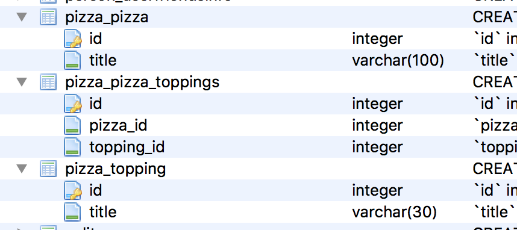

# Django Documentation

## Models
Database와 매핑됨.
`django.db.models.Model`을 하위 클래스로 묶는 Python 클래스입니다.
 모델의 각 속성은 데이터베이스 필드를 나타냅니다.
 
```python
from django.db import models

class Person(models.Model):
    first_name = models.CharField(max_length=30)
    last_name = models.CharField(max_length=30)
```
각 필드들(first_name, last_name)은 데이터베이스 열에 매핑됩니다.
그리고 위의 모델은 다음관 같은 데이터베이스 테이블을 생성합니다.
```sql
CREATE TABLE myapp_person (
    "id" serial NOT NULL PRIMARY KEY,
    "first_name" varchar(30) NOT NULL,
    "last_name" varchar(30) NOT NULL
);
```
id 필드는 자동 생성되지만 오버라이딩이 가능합니다.

### Using models
모델을 정의한 후에 Django에게 사용할것을 알려줘야합니다.
'setting'의 'INSTALLED_APPS'에 models.py가 포함된 모듈의 이름을 추가해야합니다.

```python
INSTALLED_APPS = [
    #...
    'myapp',
    #...
]
```

INSTALLED_APPS에 새 앱을 추가 할 때 반드시 `manage.py migrate`를 실행하고, 선택적으로 `manage.py makemigrations`로 마이그레이션을 수행하십시오.

-
1. models.py 에서 모델을 작성하는건 sql을 작성한는 역할
2. settings.py의 INSTALLED_APPS에 models의 추가한 모듈의 이름을 추가
3. `manage.py makemigrations` 실행 (sql문 실행 역할)
4. `manage.py migrate` 실행 (서버에 적용)
-
### Fields
필드는 테이터의 컬럼과 매칭됩니다.
모델API와 필드의 이름이 충돌되지 않도록 주의해야 합니다.

#### Field types
모델의 각 필드는 해당 **필드 클래스의 인스턴스**이어야 합니다.
```python
class Question(models.Model):	# models.py 의 클래스/models.Model클래스를 상속 받는다.
    q_text = models.CharField(max_length=200) # q_text 필드는 CharField클래스의 인스턴스이다.

    def __str__(self):
        return self.q_text
```
#### Field options
각 필드는 각각 특정 인수를 사용합니다.(인스턴스니까!)
예를 들어 CharField에는 데이터 저장에 사용되는 VARCHAR 데이터베이스 필드의 크기를 지정하는 max_length 인수가 필요합니다.

```python
q_text = models.CharField(max_length=200)
```

또한 모든 필드 유형에 사용할 수 있는 일반적인 인수들도 있습니다.
(모두 선택사항입니다.)

- null
- blank : 기본값은 False. True이면 필드는 비워둘 수 있음.
- choices
표시 값은 get_FOO_display () 메소드를 사용하여 액세스 할 수 있습니다.

```python
from django.db import models

class Person(models.Model):
    SHIRT_SIZES = (
        ('S', 'Small'),		#첫번째 요소는 DB에 저장될 값
        ('M', 'Medium'),	#두번째요소는 기본위젯,ModelChoiceField에 표시
        ('L', 'Large'),
    )
    name = models.CharField(max_length=60)
    shirt_size = models.CharField(max_length=1, choices=SHIRT_SIZES)
#선택 필드의 표시 값은 get_FOO_display () 메소드를 사용하여 액세스 할 수 있습니다.
```

```python
>>> p = Person(name="Fred Flintstone", shirt_size="L")
>>> p.save()
>>> p.shirt_size
'L'
>>> p.get_shirt_size_display()
'Large'
```

- default
- help_text : 폼 위젯의 도움말로 표시됩니다.
- primary_key : True이면이 필드는 모델의 기본 키입니다.

```python
from django.db import models

class Fruit(models.Model):
    name = models.CharField(max_length=100, primary_key=True)
```
```python
>>> fruit = Fruit.objects.create(name='Apple')	# Apple을 primary_key 로 설정
>>> fruit.name = 'Pear' # 'Pear'으로 키를 변경하려함
>>> fruit.save()
>>> Fruit.objects.values_list('name', flat=True)
['Apple', 'Pear']	# save()하면 기본값과 함께 새로운 객체가 만들어집니다.
```
- unique : True이면 해당 필드 값은 해당 테이블에서 유일한 값을 가져야 합니다.

#### Automatic primary key fields
Django의 모델은 필수적으로 하나의 Primary Key를 가져야 합니다.
직접 선언하지 않으면 Django에서 자동증가(auto increment)라는 primary Key필드를 생성합니다.

```python
id = models.AutoField(primary_key=True)
```
직접 선언하고 싶다면 모델의 필드중 하나에 `primary_key=True' 옵션을 주면 됩니다.

#### Verbose field names
필드 이름을 손쉽게 페이지에서 출력시켜줍니다.
필드들은 기본적으로 첫번째 인자로 verbose name 값을 받습니다.

```python
first_name = models.CharField("person's first name", max_length=30)
# "person's first name"이 verbose name이 됩니다.
```
첫번째 인자 값이 주어지지 않는 경우 해당 필드의 어트리뷰트 이름을 verbose name으로 사용합니다.

```python
first_name = models.CharField(max_length=30)
# first_name 이 verbose name이 됩니다.
```
ForeignKey, ManyToManyField, OneToOneField 는 첫번째 인자로 모델 클래스를 받기 때문에,
해당 필드에 verbose name을 지정하려면 verbose name을 사용해야합니다.

```python
poll = models.ForeignKey(Poll, verbose_name="the related poll")
sites = models.ManyToManyField(Site, verbose_name="list of sites")
place = models.OneToOneField(Place, verbose_name="related place")
```
verbose name은 Django가 필요한 경우 알아서 대문자로 표시하기 때문에 소문자로 입력합니다.

### Relationships (관계)
RDBMS(relational database management system,관계형 데이터베이스 관리 시스템)의 강점은 **Relationships**입니다.
테이블간의 관계를 정의하고, 그 관계를 기반으로 쿼리나DB의 무결성을 보장할 수 있습니다.

Django는 3가지 데이터베이스 관계형태를 제공합니다.
1. Many-To-One Relationships (일대다)
2. Many-to-many relationships (다대다)
3. One-to-one relationships (일대일)

#### Many-to-one relationships (일대다)
Many-to-one를 정의하려면 django.db.models.**ForeignKey** 클래스를 이용하여 필드를 선언해야합니다.
example)

```python
from django.db import models

class Manufacturer(models.Model):
    # ...
    pass

class Car(models.Model):
    manufacturer = models.ForeignKey(Manufacturer)
    # ...
```
Car모델(차)은 Manufacturer모델(제조사)를 하나만 가질 수 있지만,
Manufacturer모델은 여러 Car모델을 가질 수 있는 경우 입니다.
( ex) 현대/소나타,그렌저,산타페 )

재귀적인 관계도 가능합니다. 필드가 선언되는 시점에는 아직 클래스가 생성되지 않았기 때문에
ForeignKey 필드의 첫번째 인자로 클래스명의 문자열을 주어야 합니다.

```python
class Employee(models.Model):
    boss = models.ForeignKey('Employee')
    # ...
```
#### Many-to-many relationships
Many-to-many를 정의하려면 **ManyToManyField**를 사용합니다.
다른 필드들과 마찬가지로 모델의 클래스 속성으로 포함하여 사용합니다.
(django.db.models.ManyToManyField)

Example) Pizza는 여러가지 topping을 사용하고, 
topping은 여러가지 Pizza에 사용될 수 있습니다.

```python
from django.db import models

class Topping(models.Model):
    # ...
    pass

class Pizza(models.Model):
    # ...
    toppings = models.ManyToManyField(Topping)
```
ForeignKey 필드와 마찬가지로 재귀적인 관계로 선언이 가능합니다.
ManyToManyField의 필드이름은 복수형으로 하는것을 추천합니다.(필수는 아님)
ManyToManyField는 관계를 가지는 두가지 모델중 한쪽만 선언하면 됩니다.
(admin 페이지에서 편집한쪽에 선언하면 됩니다.)

#### Extra fields on many-to-many relationships
many-to-many에서 두모델간의 관계가 추가적인 데이터를 가지는 경우가 있습니다.
이런 경우 두 모델의 관계와 추가데이터를 저장할 또 다른 모델이 중간모델(intermediate model)입니다.
Pizza와 Topping의 경우는 Django가 알아서 중간 모델을 만들어줍니다.

이 중간 모델을 직접 선언할 수도 있습니다.
중간 모델은 **through**을 사용하여 중개자 역할의 모델을 가리키는 **ManyToManyField**와 연결합니다.

```python
class Idol(models.Model):
    name = models.CharField(max_length=100)

    def __str__(self):
        return self.name


class Group(models.Model):
    name = models.CharField(max_length=100)
    members = models.ManyToManyField(
        Idol,
        through='MemberShip',
        through_fields=('group', 'idol'),
    )

    def __str__(self):
        return self.name


class MemberShip(models.Model):
    group = models.ForeignKey(Group)
    idol = models.ForeignKey(Idol)

    date_joined = models.DateTimeField()
    recommender = models.ForeignKey(
        Idol,
        null=True,
        blank=True,
        related_name='recommender_membership_set'
    )

    def __str__(self):
        return '{} {}'.format(
            self.group.name,
            self.idol.name,
            self.date_joined,
        )
```

```
In [1]: from person.models import Idol, Group, MemberShip

In [2]: yui = Idol.objects.create(name='유이')

In [3]: reina = Idol.objects.create(name='레이나')

In [4]: nana = Idol.objects.create(name='나나')

In [5]: lizzy = Idol.objects.create(name='리지')

In [6]: eyoung = Idol.objects.create(name='이영')

In [7]: kaeun = Idol.objects.create(name='가은')

In [8]: Idol.objects.values_list()
Out[8]: <QuerySet [(1, '유이'), (2, '레이나'), (3, '나나'), (4, '리지'), (5, '이영'), (6, '가은')]>

In [9]: Idol.objects.values_list('name')
Out[9]: <QuerySet [('유이',), ('레이나',), ('나나',), ('리지',), ('이영',), ('가은',)]>

In [10]: afterschool = Group.objects.create(name='애프터스쿨')

In [11]: orangecaramel = Group.objects.create(name='오렌지캬라멜')

In [12]: from person.models import MemberShip

In [13]: from datetime import date

In [14]: m1 = MemberShip(
    ...: idol=reina,
    ...: group=orangecaramel,
    ...: date_joined=date(2010, 6, 17)
    ...: )

In [15]: m1.save()

In [16]: m1
Out[16]: <MemberShip: MemberShip object>

In [17]: m1 = MemberShip(
    ...: idol=nana,
    ...: group=orangecaramel,
    ...: date_joined=date(2010, 6, 17)
    ...: )

In [18]: m1 = MemberShip(
    ...: idol=reina,
    ...: group=orangecaramel,
    ...: date_joined=date(2010, 6, 17)
    ...: )

In [19]: m2 = MemberShip(
    ...: idol=nana,
    ...: group=orangecaramel,
    ...: date_joined=date(2010, 6, 17)
    ...: )

In [20]: m3 = MemberShip(
    ...: idol=lizzy,
    ...: group=orangecaramel,
    ...: date_joined=date(2010, 6, 17)
    ...: )

In [24]: m2.save()

In [25]: m3.save()

In [26]: MemberShip.objects.values_list('idol__name', flat=True)
Out[26]: <QuerySet ['레이나', '나나', '리지']>

In [27]: orangecaramel.members.all()
Out[27]: <QuerySet [<Idol: 레이나>, <Idol: 나나>, <Idol: 리지>]>

In [28]: nana.group_set.all()
Out[28]: <QuerySet [<Group: 오렌지캬라멜>]>

In [32]: nana.membership_set.values_list('group__name', 'date_joined')
Out[32]: <QuerySet [('오렌지캬라멜', datetime.datetime(2010, 6, 17, 0, 0, tzinfo=<UTC>))]>

In [33]: for idol in Idol.objects.all():
    ...:     MemberShip.objects.create(
    ...:     idol=idol,
    ...:     group=afterschool,
    ...:     date_joined=date(2009, 1, 15)
    ...:     )
    ...:     

In [34]: afterschool.members.values_list('name')
Out[34]: <QuerySet [('유이',), ('레이나',), ('나나',), ('리지',), ('이영',), ('가은',)]>

In [35]: Idol.objects.all()
Out[35]: <QuerySet [<Idol: 유이>, <Idol: 레이나>, <Idol: 나나>, <Idol: 리지>, <Idol: 이영>, <Idol: 가은>]>

In [36]: orangecaramel.members.all()
Out[36]: <QuerySet [<Idol: 레이나>, <Idol: 나나>, <Idol: 리지>]>

In [37]: lizzy.group_set.all()
Out[37]: <QuerySet [<Group: 오렌지캬라멜>, <Group: 애프터스쿨>]>

In [38]: afterschool.members.values_list('name')
Out[38]: <QuerySet [('유이',), ('레이나',), ('나나',), ('리지',), ('이영',), ('가은',)]>

In [39]: nana.membership_set.values_list('group__name', 'date_joined')
Out[39]: <QuerySet [('오렌지캬라멜', datetime.datetime(2010, 6, 17, 0, 0, tzinfo=<UTC>)), ('애프터스쿨', datetime.datetime(2009, , tzinfo=<UTC>))]>

In [40]: MemberShip.objects.all()
Out[2]: <QuerySet [<MemberShip: 오렌지캬라멜 레이나>, <MemberShip: 오렌지캬라멜 나나>, <MemberShip: 오렌지캬라멜 리지>, <MemberShp: 애프터스쿨 레이나>, <MemberShip: 애프터스쿨 나나>, <MemberShip: 애프터스쿨 리지>, <MemberShip: 애프터스쿨 이영>, <MemberShip: 애프터스쿨 가은>]>
```
중간모델을 직접 설정할 때, 두 모델에 대한 ForeignKey 필드를 선언하고 추가적인 필드를 선언합니다.

제약사항
- 중간 모델은 원본모델에 대해 **단 하나의 ForeignKey 필드**를 가져야 합니다. 아니면 ManyToManyField.through_fields를 사용하여 관계에 사용해야하는 외래키를 명시적으로 지정해야합니다.
- 


# 질문

Person.objects.values_list('name')
튜플로 리스트를 묶어서 출력
Person.objects.values_list('name', flat=True)
리스트로 바로 출력
