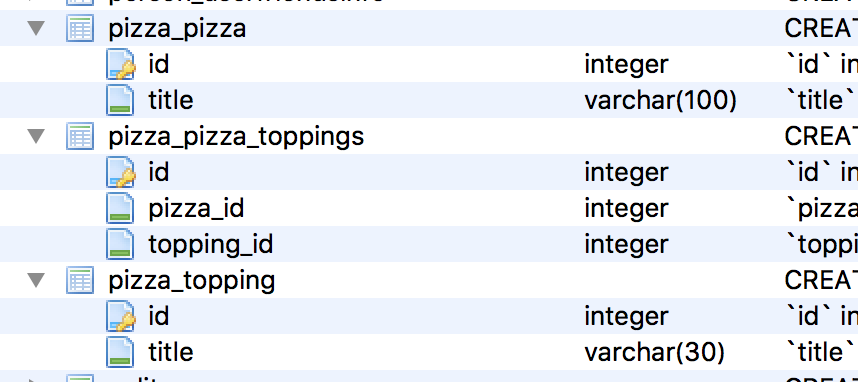

# Django Documentation

## Models
Database와 매핑됨.
`django.db.models.Model`을 하위 클래스로 묶는 Python 클래스입니다.
 모델의 각 속성은 데이터베이스 필드를 나타냅니다.
 
```python
from django.db import models

class Person(models.Model):
    first_name = models.CharField(max_length=30)
    last_name = models.CharField(max_length=30)
```
각 필드들(first_name, last_name)은 데이터베이스 열에 매핑됩니다.
그리고 위의 모델은 다음관 같은 데이터베이스 테이블을 생성합니다.
```sql
CREATE TABLE myapp_person (
    "id" serial NOT NULL PRIMARY KEY,
    "first_name" varchar(30) NOT NULL,
    "last_name" varchar(30) NOT NULL
);
```
id 필드는 자동 생성되지만 오버라이딩이 가능합니다.

### Using models
모델을 정의한 후에 Django에게 사용할것을 알려줘야합니다.
'setting'의 'INSTALLED_APPS'에 models.py가 포함된 모듈의 이름을 추가해야합니다.

```python
INSTALLED_APPS = [
    #...
    'myapp',
    #...
]
```

INSTALLED_APPS에 새 앱을 추가 할 때 반드시 `manage.py migrate`를 실행하고, 선택적으로 `manage.py makemigrations`로 마이그레이션을 수행하십시오.

-
1. models.py 에서 모델을 작성하는건 sql을 작성한는 역할
2. settings.py의 INSTALLED_APPS에 models의 추가한 모듈의 이름을 추가
3. `manage.py makemigrations` 실행 (sql문 실행 역할)
4. `manage.py migrate` 실행 (서버에 적용)

-
### Fields
필드는 테이터의 컬럼과 매칭됩니다.
모델API와 필드의 이름이 충돌되지 않도록 주의해야 합니다.

#### Field types
모델의 각 필드는 해당 **필드 클래스의 인스턴스**이어야 합니다.
```python
class Question(models.Model):	# models.py 의 클래스/models.Model클래스를 상속 받는다.
    q_text = models.CharField(max_length=200) # q_text 필드는 CharField클래스의 인스턴스이다.

    def __str__(self):
        return self.q_text
```

#### Field options
각 필드는 각각 특정 인수를 사용합니다.(인스턴스니까!)
예를 들어 CharField에는 데이터 저장에 사용되는 VARCHAR 데이터베이스 필드의 크기를 지정하는 max_length 인수가 필요합니다.

```python
q_text = models.CharField(max_length=200)
```

또한 모든 필드 유형에 사용할 수 있는 일반적인 인수들도 있습니다.
(모두 선택사항입니다.)

- null
- blank : 기본값은 False. True이면 필드는 비워둘 수 있음.
- choices
표시 값은 get_FOO_display () 메소드를 사용하여 액세스 할 수 있습니다.

```python
from django.db import models

class Person(models.Model):
    SHIRT_SIZES = (
        ('S', 'Small'),		#첫번째 요소는 DB에 저장될 값
        ('M', 'Medium'),	#두번째요소는 기본위젯,ModelChoiceField에 표시
        ('L', 'Large'),
    )
    name = models.CharField(max_length=60)
    shirt_size = models.CharField(max_length=1, choices=SHIRT_SIZES)
#선택 필드의 표시 값은 get_FOO_display () 메소드를 사용하여 액세스 할 수 있습니다.
```

```python
>>> p = Person(name="Fred Flintstone", shirt_size="L")
>>> p.save()
>>> p.shirt_size
'L'
>>> p.get_shirt_size_display()
'Large'
```

- default
- help_text : 폼 위젯의 도움말로 표시됩니다.
- primary_key : True이면이 필드는 모델의 기본 키입니다.

```python
from django.db import models

class Fruit(models.Model):
    name = models.CharField(max_length=100, primary_key=True)
```
```python
>>> fruit = Fruit.objects.create(name='Apple')	# Apple을 primary_key 로 설정
>>> fruit.name = 'Pear' # 'Pear'으로 키를 변경하려함
>>> fruit.save()
>>> Fruit.objects.values_list('name', flat=True)
['Apple', 'Pear']	# save()하면 기본값과 함께 새로운 객체가 만들어집니다.
```
- unique : True이면 해당 필드 값은 해당 테이블에서 유일한 값을 가져야 합니다.

#### Automatic primary key fields
Django의 모델은 필수적으로 하나의 Primary Key를 가져야 합니다.
직접 선언하지 않으면 Django에서 자동증가(auto increment)라는 primary Key필드를 생성합니다.

```python
id = models.AutoField(primary_key=True)
```
직접 선언하고 싶다면 모델의 필드중 하나에 `primary_key=True' 옵션을 주면 됩니다.

#### Verbose field names
필드 이름을 손쉽게 페이지에서 출력시켜줍니다.
필드들은 기본적으로 첫번째 인자로 verbose name 값을 받습니다.

```python
first_name = models.CharField("person's first name", max_length=30)
# "person's first name"이 verbose name이 됩니다.
```
첫번째 인자 값이 주어지지 않는 경우 해당 필드의 어트리뷰트 이름을 verbose name으로 사용합니다.

```python
first_name = models.CharField(max_length=30)
# first_name 이 verbose name이 됩니다.
```
ForeignKey, ManyToManyField, OneToOneField 는 첫번째 인자로 모델 클래스를 받기 때문에,
해당 필드에 verbose name을 지정하려면 verbose name을 사용해야합니다.

```python
poll = models.ForeignKey(Poll, verbose_name="the related poll")
sites = models.ManyToManyField(Site, verbose_name="list of sites")
place = models.OneToOneField(Place, verbose_name="related place")
```
verbose name은 Django가 필요한 경우 알아서 대문자로 표시하기 때문에 소문자로 입력합니다.

### Relationships (관계)
RDBMS(relational database management system,관계형 데이터베이스 관리 시스템)의 강점은 **Relationships**입니다.
테이블간의 관계를 정의하고, 그 관계를 기반으로 쿼리나DB의 무결성을 보장할 수 있습니다.

Django는 3가지 데이터베이스 관계형태를 제공합니다.
1. Many-To-One Relationships (일대다)
2. Many-to-many relationships (다대다)
3. One-to-one relationships (일대일)

#### Many-to-one relationships (일대다)
Many-to-one를 정의하려면 django.db.models.**ForeignKey** 클래스를 이용하여 필드를 선언해야합니다.
example)

```python
from django.db import models

class Manufacturer(models.Model):
    # ...
    pass

class Car(models.Model):
    manufacturer = models.ForeignKey(Manufacturer)
    # ...
```
Car모델(차)은 Manufacturer모델(제조사)를 하나만 가질 수 있지만,
Manufacturer모델은 여러 Car모델을 가질 수 있는 경우 입니다.
( ex) 현대/소나타,그렌저,산타페 )

재귀적인 관계도 가능합니다. 필드가 선언되는 시점에는 아직 클래스가 생성되지 않았기 때문에
ForeignKey 필드의 첫번째 인자로 클래스명의 문자열을 주어야 합니다.

```python
class Employee(models.Model):
    boss = models.ForeignKey('Employee')
    # ...
```
#### Many-to-many relationships
Many-to-many를 정의하려면 **ManyToManyField**를 사용합니다.
다른 필드들과 마찬가지로 모델의 클래스 속성으로 포함하여 사용합니다.
(django.db.models.ManyToManyField)

Example) Pizza는 여러가지 topping을 사용하고, 
topping은 여러가지 Pizza에 사용될 수 있습니다.

```python
from django.db import models

class Topping(models.Model):
    # ...
    pass

class Pizza(models.Model):
    # ...
    toppings = models.ManyToManyField(Topping)
```
ForeignKey 필드와 마찬가지로 재귀적인 관계로 선언이 가능합니다.
ManyToManyField의 필드이름은 복수형으로 하는것을 추천합니다.(필수는 아님)
ManyToManyField는 관계를 가지는 두가지 모델중 한쪽만 선언하면 됩니다.
(admin 페이지에서 편집한쪽에 선언하면 됩니다.)

#### Extra fields on many-to-many relationships
many-to-many에서 두모델간의 관계가 추가적인 데이터를 가지는 경우가 있습니다.
이런 경우 두 모델의 관계와 추가데이터를 저장할 또 다른 모델이 중간모델(intermediate model)입니다.
Pizza와 Topping의 경우는 Django가 알아서 중간 모델을 만들어줍니다.

이 중간 모델을 직접 선언할 수도 있습니다.
중간 모델은 **through**을 사용하여 중개자 역할의 모델을 가리키는 **ManyToManyField**와 연결합니다.

```python
class Idol(models.Model):
    name = models.CharField(max_length=100)

    def __str__(self):
        return self.name


class Group(models.Model):
    name = models.CharField(max_length=100)
    members = models.ManyToManyField(
        Idol,
        through='MemberShip',
        through_fields=('group', 'idol'),
    )

    def __str__(self):
        return self.name


class MemberShip(models.Model):
    group = models.ForeignKey(Group)
    idol = models.ForeignKey(Idol)

    date_joined = models.DateTimeField()
    recommender = models.ForeignKey(
        Idol,
        null=True,
        blank=True,
        related_name='recommender_membership_set'
    )

    def __str__(self):
        return '{} {}'.format(
            self.group.name,
            self.idol.name,
            self.date_joined,
        )
```
중간모델을 직접 설정할 때, 두 모델에 대한 ForeignKey 필드를 선언하고 추가적인 필드를 선언합니다.

제약사항
- 중간 모델은 원본모델에 대해 **단 하나의 ForeignKey 필드**를 가져야 합니다. 아니면 ManyToManyField.through_fields를 사용하여 관계에 사용해야하는 외래키를 명시적으로 지정해야합니다.
- 중간 모델을 통해 ManyToMany 관계를 갖는 모델의 경우 동일한 모델에 대한 두 개의 외래 키가 허용됩니다. 두 개 이상의 외래 키가있는 경우 **through_fields**도 지정해야합니다.
- 중간모델을 사용하여 ManyToMany 관계를 정의할 때는 **symmetrical=False**으로 설정해야 합니다.

```
In [1]: from person.models import Idol, Group, MemberShip

In [2]: yui = Idol.objects.create(name='유이')

In [3]: reina = Idol.objects.create(name='레이나')

In [4]: nana = Idol.objects.create(name='나나')

In [5]: lizzy = Idol.objects.create(name='리지')

In [6]: eyoung = Idol.objects.create(name='이영')

In [7]: kaeun = Idol.objects.create(name='가은')

In [8]: Idol.objects.values_list()
Out[8]: <QuerySet [(1, '유이'), (2, '레이나'), (3, '나나'), (4, '리지'), (5, '이영'), (6, '가은')]>

In [9]: Idol.objects.values_list('name')
Out[9]: <QuerySet [('유이',), ('레이나',), ('나나',), ('리지',), ('이영',), ('가은',)]>

In [10]: afterschool = Group.objects.create(name='애프터스쿨')

In [11]: orangecaramel = Group.objects.create(name='오렌지캬라멜')

In [12]: from person.models import MemberShip

In [13]: from datetime import date

In [14]: m1 = MemberShip(
    ...: idol=reina,
    ...: group=orangecaramel,
    ...: date_joined=date(2010, 6, 17)
    ...: )

In [15]: m1.save()

In [16]: m1
Out[16]: <MemberShip: MemberShip object>

In [17]: m1 = MemberShip(
    ...: idol=nana,
    ...: group=orangecaramel,
    ...: date_joined=date(2010, 6, 17)
    ...: )

In [18]: m1 = MemberShip(
    ...: idol=reina,
    ...: group=orangecaramel,
    ...: date_joined=date(2010, 6, 17)
    ...: )

In [19]: m2 = MemberShip(
    ...: idol=nana,
    ...: group=orangecaramel,
    ...: date_joined=date(2010, 6, 17)
    ...: )

In [20]: m3 = MemberShip(
    ...: idol=lizzy,
    ...: group=orangecaramel,
    ...: date_joined=date(2010, 6, 17)
    ...: )

In [24]: m2.save()

In [25]: m3.save()

In [26]: MemberShip.objects.values_list('idol__name', flat=True)
Out[26]: <QuerySet ['레이나', '나나', '리지']>

In [27]: orangecaramel.members.all()
Out[27]: <QuerySet [<Idol: 레이나>, <Idol: 나나>, <Idol: 리지>]>

In [28]: nana.group_set.all()
Out[28]: <QuerySet [<Group: 오렌지캬라멜>]>

In [32]: nana.membership_set.values_list('group__name', 'date_joined')
Out[32]: <QuerySet [('오렌지캬라멜', datetime.datetime(2010, 6, 17, 0, 0, tzinfo=<UTC>))]>

In [33]: for idol in Idol.objects.all():
    ...:     MemberShip.objects.create(
    ...:     idol=idol,
    ...:     group=afterschool,
    ...:     date_joined=date(2009, 1, 15)
    ...:     )
    ...:     

In [34]: afterschool.members.values_list('name')
Out[34]: <QuerySet [('유이',), ('레이나',), ('나나',), ('리지',), ('이영',), ('가은',)]>

In [35]: Idol.objects.all()
Out[35]: <QuerySet [<Idol: 유이>, <Idol: 레이나>, <Idol: 나나>, <Idol: 리지>, <Idol: 이영>, <Idol: 가은>]>

In [36]: orangecaramel.members.all()
Out[36]: <QuerySet [<Idol: 레이나>, <Idol: 나나>, <Idol: 리지>]>

In [37]: lizzy.group_set.all()
Out[37]: <QuerySet [<Group: 오렌지캬라멜>, <Group: 애프터스쿨>]>

In [38]: afterschool.members.values_list('name')
Out[38]: <QuerySet [('유이',), ('레이나',), ('나나',), ('리지',), ('이영',), ('가은',)]>
```
일반적인 ManyToManyField와 달리 add(), create(), set() 할 수 없습니다.

```
>>> orangecaramel.members.add(Yoona)
>>> orangecaramel.members.create(name="Yoona")
>>> orangecaramel.members.set([레이나, 나나, 리지])
```
Idol과 Group의 관계를 설정할 때는 중간모델(MemberShip)의 필드 값들을 명시해주어야 하기 때문입니다. 이러한 경우는 중간모델을 통해 선언해야만 합니다.

```
In [39]: nana.membership_set.values_list('group__name', 'date_joined')
Out[39]: <QuerySet [('오렌지캬라멜', datetime.datetime(2010, 6, 17, 0, 0, tzinfo=<UTC>)), ('애프터스쿨', datetime.datetime(2009, , tzinfo=<UTC>))]>

In [40]: MemberShip.objects.all()
Out[2]: <QuerySet [<MemberShip: 오렌지캬라멜 레이나>, <MemberShip: 오렌지캬라멜 나나>, <MemberShip: 오렌지캬라멜 리지>, <MemberShp: 애프터스쿨 레이나>, <MemberShip: 애프터스쿨 나나>, <MemberShip: 애프터스쿨 리지>, <MemberShip: 애프터스쿨 이영>, <MemberShip: 애프터스쿨 가은>]>
```
remove() 메서드도 유사한 이유로 사용할 수 없습니다. clear() 메서드는 사용이 가능합니다.

```
>>> orangrcaramel.members.clear()
>>> # Note that this deletes the intermediate model instances
>>> Membership.objects.all()
```
관계를 설정할 때는 위와 같이 제약이 걸리지만, 쿼리를 할때는 일반적인 ManyToMany 관계와 동일하게 사용할 수 있습니다.

```
# '유'로 시작하는 멤버를 가진 그룹을 찾습니다.
>>> Group.objects.filter(members__name__startswith='유')
<QuerySet [<Group: 애프터스쿨>]>
```

```
# Idol중에 그룹이 '오렌지캬라멜'이고 2009년1월15일에 가입한 멤버를 찾습니다.
 Idol.objects.filter(
 ...     group__name='오렌지캬라멜',
 ...     membership__date_joined__gt=date(2009,1,15))
 <QuerySet [<Idol: 레이나>, <Idol: 나나>, <Idol: 리지>]>
```
그 외에도 중간모델에서 직접 쿼리가 가능하고, Idol 객체로붙 ManyToMany 역참조를 이용할 수도 있습니다.

#### One-to-one relationships
OneToOne 관계를 정의하려면 OneToOneField를 사용합니다. 다른 필드들과 마찬가지로 모델의 클래스 속성으로 포함하여 사용합니다.
OneToOne 관계는 다른 모델을 확장하여 새로운 모델을 만들때 사용할 수 있습니다.
OneToOneField는 관계를 맺는 모델 클래스를 첫번째 인자로 받습니다.


// 상속과 다른 점
상속은 부모클래스 필드 값들과 합쳐서 결과물을 만들어 내고 끝이지만,
관계는 인스턴스화한 후에도 관계된 클래스(테이블)들의 정보 접근이 가능합니다.

### Models across files
다른 앱의 모델과 연결할 수 있습니다.

```python
from django.db import models
from geography.models import ZipCode

class Restaurant(models.Model):
    # ...
    zip_code = models.ForeignKey(
        ZipCode,
        on_delete=models.SET_NULL,
        blank=True,
        null=True,
    )
```
### Field name restrictions
모델 필드 이름에 2가지 제약이 있습니다.
1. 파이썬 예약어
2. `__` : `__`는 Django에서 특별한 문법으로 사용되기 때문입니다.
SQL 예약어는 사용이 가능합니다. Django가 쿼리문을 만들때, 모든 컬럼명과 테이블명을 모두 이스케이프 처리하기 때문입니다.

### Custom field types
Django에서 제공하는 필드타입들 중 내가 사용할 목적에 적합한게 없거나 특정 DB에서만 제공하고 싶으면, 직접 필드를 만들어 사용할 수 있습니다.  
참조. [Writing custom model fields](https://docs.djangoproject.com/en/1.10/howto/custom-model-fields/)

### Meta options
모델 클래스 내부에 Meta 클래스를 선언하여 사용합니다.

```python
from django.db import models

class Ox(models.Model):
    horn_length = models.IntegerField()

    class Meta:
        ordering = ["horn_length"]
        verbose_name_plural = "oxen"
```
필드단위가 아닌 모델단위의 옵션입니다.
정렬옵션(ordering), 테이블이름(db_table), 읽기 좋은 이름(verbose_name, verbose_name_plural)을 지정할 수 있습니다.
Meta클래스는 반드시 선언할 필요는 없으며 선택사항입니다.

### Model attributes

#### objects
모델 클래스에서 가장 중요한 어트리뷰트는 Manager입니다. 머델 클래스 선언을 기반으로 실제 DB에 대한 쿼리 인터페이스를 제공하고, DB 레코드를 모델 객체로 인스턴스화 하는데 사용됩니다.
특별히 Manager를 할당하지 않으면 Django는 Default Manager 객체를 클래스 어트리뷰트로 자동 할당하고 이름은 object입니다.

모델 클래스를 통해 접근할 수 있고, 모델 인스턴스를 통해서는 접근 할 수 없습니다.

### Model methods
레코드(row) 단위의 기능을 구현하려면, 모델 클래스에서 메서드를 구현하면 됩니다.
테이블 단위의 기능의 경우는 Manager에 구현해 줍니다.

```python
from django.db import models

class Person(models.Model):
    first_name = models.CharField(max_length=50)
    last_name = models.CharField(max_length=50)
    birth_date = models.DateField()

    def baby_boomer_status(self):
        "Returns the person's baby-boomer status."
        import datetime
        if self.birth_date < datetime.date(1945, 8, 1):
            return "Pre-boomer"
        elif self.birth_date < datetime.date(1965, 1, 1):
            return "Baby boomer"
        else:
            return "Post-boomer"

    def _get_full_name(self):
        "Returns the person's full name."
        return '%s %s' % (self.first_name, self.last_name)
    full_name = property(_get_full_name)
```
"model instance reference"를 보면 모델 클래스에 자동적으로 주어지는 메서드들이 나열되어있습니다. 이러한 메서드를 여러분이 오버라이드해서 사용할 수 있습니다.

- `_srt_()` : 모델 객체가 문자열로 표현되어야 하는 경우 호출굅니다.admin이나 console 에서 모델 객체를 표시하는 경우 많이 사용합니다.

- get_absolute_url() : Django는 객체의 URL을 계산하는 방법을 알려줍니다. Django는 관리 인터페이스에서 이것을 사용하며 언제든지 객체의 URL을 찾아야합니다. 객체를 고유하게 식별하는 URL을 가진 객체는이 메소드를 정의해야합니다.

### Overriding predefined model methods
모델 클래스가 제공라는 기본적인 메서드들을 커스터마이징 할 수 있습니다.
save()나 delete() 메서드를 오버라이드하는 경우들이 많을 것입니다.

```python
from django.db import models

class Blog(models.Model):
    name = models.CharField(max_length=100)
    tagline = models.TextField()

    def save(self, *args, **kwargs):
        do_something()
        super(Blog, self).save(*args, **kwargs) # Call the "real" save() method.
        do_something_else()
```
조건이 부합되지 않으면 저장하지 못하게 할 수도 있습니다.

```python
from django.db import models

class Blog(models.Model):
    name = models.CharField(max_length=100)
    tagline = models.TextField()

    def save(self, *args, **kwargs):
        if self.name == "Yoko Ono's blog":
            return # Yoko shall never have her own blog!
        else:
            super(Blog, self).save(*args, **kwargs) # Call the "real" save() method.
```
부모 클래스의 메서드를 호출해주어야 합니다. 예제 코드에서는 `super(Blog, self).save(*args, **kwargs)`을 호출 함으로써 실제 데이터베이스에 객체가 저장되었습니다. 부모 클래스의 메서드를 호출하지 않는다면, 실제 데이터베이스에서는 아무런 동작도 일어나지 않습니다.

오버라이드한 메서드의 인자를 그대로 부모 클래스의 메서드에 넘겨주는 것도 잊지 마세요. 예제에서는 `"*args, **kwargs"` 부분입니다. Django는 계속적으로 옵션이 추가되고 확장 될것입니다. 그렇기 때문에 오버라이드 하는 메서드에 `"*args, **kwargs"` 형태로 인자를 넘겨 받고 그대로 부모 메서드에 넘겨준다면 Django의 변경사항에 관계없이 항상 잘 동작하게 됩니다.

#### Executing custom SQL
SQL 문을 직접 작성하여 실행할 수도 있습니다. [using raw SQL 침조](https://docs.djangoproject.com/en/1.10/topics/db/sql/)


### Model inheritance
모델 상속은 파이썬에서의 클래스 상속과 거의 동일한 형태로 이루어 집니다.
모델 상속의 경우에는 베이스 클래스는 django.models.Model 클래스의 서브 클래스이어야 합니다.
이때, 부모 모델이 자신의 데이터베이스 테이블을 가지도록 할것인지, 부모 모델은 실제 테이블을 생성하지 않고 자식 모델들이 부모 모델에 선언된 공동 필드를 각각 자신의 테이블에 생성할 것인지 결정해야합니다.
1. Abstract base classes
2. Multi-table inheritance
3. Proxy Model

#### Abstract base classes (추상 클래스)
여러개의 모델 클래스가 공통적인 정보를 가지도록 하고 싶은 경우에 사용합니다.
Meta클래스에 abstract=True 옵션을 선언하면 그 모델은 추상 클래스가 됩니다.
추상클래스는 데이터베이츠에 테이블을 생성하지 않습니다. 부모 클래스에 선언된 필드들을 자식 클래스의 테이블에 추가됩니다. 부모 클래스와 자식 클래스는 중복된 필드값을 가지면 안됩니다.

```python
from django.db import models

class CommonInfo(models.Model):
    name = models.CharField(max_length=100)
    age = models.PositiveIntegerField()

    class Meta:
        abstract = True

class Student(CommonInfo):
    home_group = models.CharField(max_length=5)
```
예제에서 class Student는 3개의 필드(name, age, home_group)을 가지게 됩니다.
class CommonInfo 모델은 일반적인 모델클래스처렁 독립적으로 사용할 수 없습니다. 데이터베이스에 테이블을 만들지도 않고. Manager도 가지지 않았기 때문입니다. 인스턴스화도 할 수 없습니다.
추상클래스를 이용하면 데이터베이스에 영향을 주지 않고, 파이썬 레벨에서 공통 필드를 관리할 수 있습니다.

##### Meta inheritance
자식 클래스가 Meta 클래스를 가지지 않는 경우, 자식 클래스는 부모의 메타 클래스를 상속 받습니다. 자식 클래스에서 부모 Meta 클래스를 상속 받으려면 아래와 같이 부모 클래스에 선언된 Meta 클래스로부터 상속 받으면 됩니다. 

```python
from django.db import models

class CommonInfo(models.Model):
    # ...
    class Meta:
        abstract = True
        ordering = ['name']

class Student(CommonInfo):
    # ...
    class Meta(CommonInfo.Meta):
        db_table = 'student_info'
```
자식클래스의  Meta 클래스를 활성화하기 전에 Django는 내부적으로 abstract 옵션을 False로 변경합니다. 즉, **추상 클래스를 상속한다고해서 자식 클래스까지 추상클래스가 되는것은 아닙니다.** 자식 클래스까지 추상클래스로 만드려는 경우에는 Meta 클래스에 abstract=True 옵션을 한번 더 선언하면 됩니다.
 일부 Meta 클래스 옵션은 추상클래스에서는 사용할 수 없습니다. 예를 들어 추상 클래스는 데이터테이블 테이블을 만들지 않기 때문에 db-table 옵션은 의미가 없습니다. 물론 자식 클래스에는 상속됩니다.(모든 자식클래스들이 동일한 테이블을 사용하는 것이 아니기 때문에 의미 없습니다.)
 
##### Be careful with related_name
Person 모델에 ForeignKey 필드가 하나 있다고 칩시다. 이 때, 이 ForeignKey 필드는 Group 모델과 관계를 가집니다. 이 경우 기본적으로 Group 모델에 person_set 이라는 어트리뷰트가 자동으로 생성되며, 이 어트리뷰트는 Group 모델과 관계된 Person 모델들을 엑세스 할 수 있도록 해줍니다. 이때 related_name 옵션을 지정하여, person_set이 아닌 다른 이름을 직접 지정할 수 있습니다. 
그런데, Animal 이라는 모델 또한 Group 모델에 대한 ForeignKey 필드를 가지고 있다면 어떻게 될까요? Group 필드는 person_set 과 animal_set 이라는 역참조 어트리뷰트를 가지게 됩니다. 그런데, Person 모델과 Animal 모델의 ForeignKey 필드에 related_name 옵션을 동일하게 설정했다고 생각해봅시다. 이 경우 각각의 모델에 대한 역참조 어트리뷰트가 중복되기 때문에 에러가 발생됩니다. 물론 이 경우 Person 모델과 Animal 모델 각각의 related_name 값을 다르게 설정해서 문제를 해결할 수 있습니다.
그런데 만약 추상 모델에 관계필드가 선언되어있고, related_name 옵션을 설정했다고 가정해봅시다. 이 추상 모델을 상속 받는 자식들은 동일한 역참조 이름을 가지는 관계필드를 가지게 됩니다.

related_name 값을 설정할때, 그 값으로 '%(app_label)s' 와 '%(class)s' 조합하여 사용하면 이러한 문제를 해결할 수 있습니다.

'%(class)s' 는 자식 클래스의 소문자화된 이름으로 치환됩니다.
'%(app_label)s'는 자식 클래스가 선언된 앱의 이름입니다. 역시 소문자화 된 이름입니다. 
설치된 앱들간에 앱 이름은 중복될 수 없으며, 하나의 앱내에서 모델의 이름은 중복될 수 없습니다. 그러므로 이 두개의 조합으로 유일한 이름이 만들어 지게됩니다.

```python
# common/models.py

from django.db import models

class Base(models.Model):
    m2m = models.ManyToManyField(
        OtherModel,
        related_name="%(app_label)s_%(class)s_related",
        related_query_name="%(app_label)s_%(class)ss",
    )

    class Meta:
        abstract = True

class ChildA(Base):
    pass

class ChildB(Base):
    pass
```

```python
# another app rare/models.py:

from common.models import Base

class ChildB(Base):
    pass
```
ChildA.m2m 필드의 역참조 이름은 common_childa_related 가 되며, ChildB.m2m 필드는 common_childb_related 가 됩니다. 즉, OtherModel은 common_childa_related, common_childb_related 두 개의 역참조 어트리뷰트를 가지게 됩니다.
rare/models.py 에 선언된 모델의 경우에 역참조 이름은 rare_childb_related 가 됩니다. 
참고로, 만약 이 경우에 Base 모델 클래스에서 m2m 필드에 related_name 옵션을 지정하지 않으면, 상속받은 자식클래스의 이름을 기준으로 역참조 이름이 결정됩니다. 즉, ChildA 클래스는 childa_set, ChildB 클래스는 childb_set 으로 역참조 이름이 결정됩니다. 


#### Multi-table inheritance
부모 모델과 자식 모델 모두 각자의 데이터베이스 테이블을 가집니다. 공통부분의 데이터는 부모모델의 테이블에 저장하고, 자식모델의 데이터는 자식모델의 테이블에 저장하고, 자식 모델은 부모모델에 대한 링크를 가집니다. 링크는 OneToOneField를 사용합니다.

```python
from django.db import models

class Place(models.Model):
    name = models.CharField(max_length=50)
    address = models.CharField(max_length=80)

class Restaurant(Place):
    serves_hot_dogs = models.BooleanField(default=False)
    serves_pizza = models.BooleanField(default=False)
```
Place 모델에 선언된 모든 필드는 Restaurant 모델에서도 사용이 가능합니다. 각 모델의 필드값들은 서로 다른 테이블에 각각 저장됩니다.

```python
>>> Place.objects.filter(name="Bob's Cafe")
>>> Restaurant.objects.filter(name="Bob's Cafe")
```
Place 모델을 통해 Restaurant 모델 객체를 쿼리 할 수 있습니다. 단 place 모델에 선언된 필드만 엑서스 가능하고, 자동으로 제공되는 restaurant 어트리뷰트를 통해 Restaurant 객체에 접근이 가능합니다. 이때 어트리뷰트의 이름은 자식 클래스의 이름을 소문자화한 이름입니다.

```
>>> p = Place.objects.get(id=12)
# If p is a Restaurant object, this will give the child class:
>>> p.restaurant
<Restaurant: ...>
```
위의 예에서 p가 Restaurant 객체가 아니라면(Place 모델에서 직접 선언되거나, Restaurant 모델이 아닌 다른 자식클래스를 통해 만들어진 경우), restaurant 어트리뷰트에 접근하면 Restaurant.DoesNotExist 예외가 발생됩니다.

##### Meta and multi-table inheritance
multi-table 상속의 경우 기본적으로 자식모델은 부모모델의 Meta 클래스를 상속받지 않습니다.
단, 자식 모델에 ordering_get_latest_by 옵셥이 지정되지 않을 경우에 한해 부모 모델의 해당 설정 값을 상속 받습니다.

부모 모델의 ordering 값을 상속 받고 싶지 않다면, 자식 모델에 ordering 옵셥을 아래와 같이 설정해주면 됩니다.

```python
class ChildModel(ParentModel):
    # ...
    class Meta:
        # Remove parent's ordering effect
        ordering = []
```

##### Inheritance and reverse relations

```python
class Supplier(Place):
    customers = models.ManyToManyField(Place)
```
예를 들어 Supplier 모델이 Place 모델을 상속 받으면서,Place모델에 대한 ManyToManetField도 가지고 있으면 아래와 같이 오류를 발생합니다.

```
Reverse query name for 'Supplier.customers' clashes with reverse query
name for 'Supplier.place_ptr'.

HINT: Add or change a related_name argument to the definition for
'Supplier.customers' or 'Supplier.place_ptr'.
```
ManyToManyField 선언에 아래와 같이 related_name 옵션을 추가해주면 이 문제를 해결할 수 있습니다.

```
models.ManyToManyField(Place, related_name='provider')
```
##### Specifying the parent link field
multi-table 상속의 경우 **OneToOneField 가 자동으로 생성**됩니다. 만약 이 OneToOneField를 직접 지정하고 싶다면, OneToOneField 를 추가하고 필드 옵션에 **parent_link=True**로 설정해주면 됩니다.

#### Proxy models
테이블을 가지는 모델을 상속받되, 자식모델은 테이블을 만들 필요가 없는 경우입니다. (Abstract base classes (추상 클래스)와 반대)

proxy 모델(자식모델)을 이용해서 모델객체를 만들고, 부모모델의 테이블을 수정하고 삭제할 수도 있습니다.
proxy 모델이 원본모델과 다른점은 기본 정렬값과 같은 설정값을 원하는 데로 변경할 수 있다는 점입니다. 물론 원본 모델의 설정값은 변경되지 않습니다.

Proxy  모델 선언은 Meta 클래스에 proxy=True 로 선언하면 됩니다.

```python

from django.db import models

class Person(models.Model):
    first_name = models.CharField(max_length=30)
    last_name = models.CharField(max_length=30)

class MyPerson(Person):
    class Meta:
        proxy = True

    def do_something(self):
        # ...
        pass
```
MyPerson 클래스는 부모클래스인 Person 클래스의 테이블을 사용합니다. 아래와 같이 Person 모델로 레코드를 추가해도 MyPerson 클래스로 조회가 가능합니다.

```
>>> p = Person.objects.create(first_name="foobar")
>>> MyPerson.objects.get(first_name="foobar")
<MyPerson: foobar>
```

매서드를 재정의하거나 추가, 기본정렬옵션을 변경 할 수도 있습니다.

```python
class OrderedPerson(Person):
    class Meta:
        ordering = ["last_name"]
        proxy = True
        
        # Person 모델을 이용한 쿼리를 정렬되지 않은 상태로, OrderedPerson 모델로 쿼리할때는 last_name 기준으로 정렬되어 리턴됩니다.
```
##### QuerySets still return the model that was requested
proxy 모델에서 변경한 사항은 부모 모델에 영향을 끼치지 않습니다.

##### Base class restrictions
proxy모델은 하나의 모델만 상속받을 수 있습니다.(추상클래스 제외) proxy 모델은 여러개의 테이블로부터 레코드를 쿼리하는 기능이 없기 때문입니다. 필드를 가지지 않는 추상 모델 클래스의 경우에는 몇개든 상속이 가능합니다. proxy 모델은 자신이 선언하지 않은 Meta 옵션에 한해 부모모델(추상클래스제외)로 부터 상속받습니다.

##### Proxy model managers
proxya 모델에 manager를 지정하지 않으면, 부모모델의 manager를 상속받습니다. 직접 지정한 경우 디폴트로 직접 지정한 manager가 사용되며, 부모클래스의 manager도 사용 할 수 있습니다.

```python
from django.db import models

class NewManager(models.Manager):
    # ...
    pass

class MyPerson(Person):
    objects = NewManager()

    class Meta:
        proxy = True
```

```python
# 부모 클래스의 기본 manager를 상속 받되, 새로운 manager를 추가하려면
# 추상클래스에 새로운 manager를 선언하고 그 추상 클래스를 상속받으면 됩니다.
class ExtraManagers(models.Model):
    secondary = NewManager()

    class Meta:
        abstract = True

class MyPerson(Person, ExtraManagers):
    class Meta:
        proxy = True
        
# 이런 경우는 흔하지는 않지만, 이렇게도 가능하다는 것만 알아둡니다.
```

#### Differences between proxy inheritance and unmanaged models
모델 클래스를 생성할때 managed=False 옵션을 주면, 해당 모델은 자동으로 테이블을 생성하지 않게 됩니다. 직접 테이블을 생성해주어야 합니다. 여기에 db_table 옵션에 기존에 존재하는 모델의 테이블 이름을 지정하게 되면 proxy 모델과 거의 유사하게 됩니다.

하지만 원본 모델이 변경 된다면 proxy 모델은 따로 수정할 일이 없지만, unmanaged 모델은 변경사항이 생길때마다 직접 데이터베이스 테이블을 동일하게 수정해주어야 합니다.

manager가 처리되는 방식에서도 차이점이 있습니다. proxy 모델은 원본 모델의 디폴트  manager를 포함한 모든 manager를 상속받습니다. unmanaged 모델은 Django의 입장에서는 원본 모델과 아무런 관계가 없기 때문에 unmanaged 모델의 자체의 선언에 따릅니다. (multi-table 모델도 부모 모델의 manager를 상속받지 못합니다.)

django는 하나의 옵션으로 합쳐보려하였지만 api가 복잡하고 이해하기 어려워져서 그냥 2가지 옵션을 따로 제공하기로 하였습니다.

1. 만약 이미 존재하는 모델이나 데이터베이스 테이블을 참조하되, 원본 테이블의 모든 컬럼이 필요하지 않는다면, Meta.managed=False 옵션을 사용하세요. Django에 의해 제어되지 않는 데이터베이스 뷰나 테이블을 사용하는 경우에 유용합니다.
2. 만얀 기존 모델의 파이썬 코드들을 오버라이드 하되, 원본 모델과 동일한 필드가 가지고 싶다면 Meta.proxy=True 옵션을 사용하세요.

### Multiple inheritance
파이썬의 상속과 마찬가지로 Django모델도 다중 상속이 가능합니다. 부모클래스들이 각각 Meta 클래스를 가지는 경우 첫번째 부모의 Meta클래스를 상속받고 나머지 부모 클래스의 Meta클래스는 무시됩니다.

일반적으로는 여러 부모 모델을 상속 받는 경우는 드물지만, 많이 쓰이는 경우는 'mix-in'클래스들 입니다. 공통적으로 필드나 메서드들을 묶어 하나의 클래스로 선언하고 이 클래스를 여러 모델 클래스에 상속하는 경우입니다.

```python
# 공통 id 기본 키 필드가 있는 여러 모델을 상속하면 오류가 발생합니다.

class Article(models.Model):
    headline = models.CharField(max_length=50)
    body = models.TextField()

class Book(models.Model):
    title = models.CharField(max_length=50)

class BookReview(Book, Article):
    pass
```

```python
# id필드(AutoField)를 가지는 공용 모델(Piece)을 만들어 id값이 항상 공용모델을 기준으로 생성되도록 하여 해결할 수 있습니다.

class Piece(models.Model):
    pass

class Article(Piece):
    ...

class Book(Piece):
    ...

class BookReview(Book, Article):
    pass
```

#### Field name “hiding” is not permitted
Django에서 필드 어트리뷰트의 경우 오버라이드가 허용되지 않습니다. 만약 부모 클래스가 author라는 이름의 필드를 선언하고 있다면, 자식 클래스는 같은 이름의 필드를 선언할 수 없습니다.
이러한 제약은 필드 어트리뷰트에만 해당합니다. 일반 파이썬 어트리뷰트는 오버라이드가 가능합니다.
 multi-table 상속의 경우에는 어트리뷰트 이름이 다르더라도 데이터베이스 컬럼명을 직접 지정하여, 부모와 자식 테이블 각각의 컬럼명을 동일하게 사용할 수는 있습니다.
 참고로 Django는 부모 모델의 필드를 오버라이드 하면 FieldError를 발생시킵니다.

### Organizing models in a package
많은 모델이있는 경우이를 별도의 파일로 구성하는 것이 좋습니다. 이러한 경우 모델 패키지를 만드십시오.
`models.py`를 제거하고 `myapp / models / 디렉토리`를 만들고 `__init__.py` 파일과 모델을 저장할 파일을 만듭니다. `__init__.py` 파일에서 모델을 가져와야합니다.

```python
# myapp/models/__init__.py

from .organic import Person
from .synthetic import Robot
```
`.models import *`를 사용하는 대신 명시적으로 각 모델을 가져오면 네임 스페이스가 복잡해지지 않고 읽기 쉽고 코드 분석이 유용해집니다.


참조
https://docs.djangoproject.com/
http://nukggul.tistory.com/
